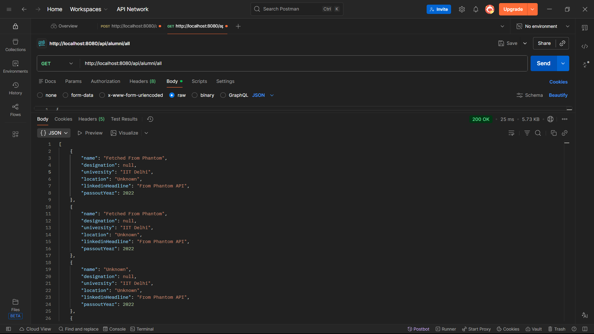

🎓 Alumni Searcher — Spring Boot Assignment

A Spring Boot backend application that fetches alumni data from the PhantomBuster API, filters it based on user criteria, stores it in PostgreSQL, and exposes REST APIs for search and retrieval.

This project demonstrates API integration, JSON parsing, database persistence, filtering logic, and unit testing using JUnit and Mockito with a clean layered architecture.

🚀 Tech Stack

Java 17

Spring Boot

PostgreSQL

Spring Data JPA / Hibernate

PhantomBuster API

Jackson JSON Parser

JUnit 5

Mockito

Maven

📦 Features

✅ Fetch alumni data from PhantomBuster API
✅ Parse JSON response
✅ Filter alumni by university and designation
✅ Store alumni data in PostgreSQL database
✅ REST API endpoints for search and retrieval
✅ Unit testing with Mockito
✅ Clean service-based architecture

🏗 Project Architecture

The project follows a layered architecture:

Controller → Handles API requests
Service → Business logic and data processing
Repository → Database operations
Entity → Database table mapping
DTO → Request and Response objects

This separation keeps the code clean, maintainable, and scalable.

⚙️ Setup & Run Application
1️⃣ Clone Repository
git clone https://github.com/vatsasiddhartha/Alumni_Searcher.git
cd Alumni_Searcher

2️⃣ Configure PostgreSQL

Create a database in PostgreSQL:

CREATE DATABASE alumni_db;

3️⃣ Update application.properties

Update your database credentials:

spring.datasource.url=jdbc:postgresql://localhost:5432/alumni_db
spring.datasource.username=postgres
spring.datasource.password=your_password

spring.jpa.hibernate.ddl-auto=update
spring.jpa.show-sql=true

4️⃣ Run Application
mvn spring-boot:run

Application will run at:

http://localhost:8080

🔌 API Endpoints
✅ Search Alumni (Fetch + Filter + Save)

Fetches data from PhantomBuster, filters results, and saves matching alumni to database.

POST /search

Request Body Example
{
  "university": "IIT Delhi",
  "designation": "Software Engineer",
  "passoutYear": 2023
}

Response

Returns filtered alumni data and stores records in PostgreSQL.

✅ Get All Alumni

Fetch all stored alumni records from database.

GET /all

Returns all saved alumni.

🗄 Database Verification

To verify saved records in PostgreSQL:

SELECT * FROM alumini;

🧪 Unit Testing

This project includes unit tests for service layer logic.

Testing Tools

JUnit 5

Mockito

Run Tests
mvn test

📊 Test Scenarios Covered

Successful API fetch and save

No matching results

Multiple alumni filtering

Empty Phantom API response handling

Case-insensitive filtering

Partial university matching

Null filter handling

Repository save verification

🔄 Application Flow

User sends search request

Service fetches data from PhantomBuster API

JSON response is parsed

Data is filtered based on request criteria

Matching records are stored in PostgreSQL

Response is returned to user

📸 Screenshots

Below are the results of testing the main APIs of the application.

✅ POST API — Search & Save Alumni

This API fetches alumni data from the PhantomBuster API, filters it based on the user’s input, and saves matching records into the PostgreSQL database.

Endpoint
POST /search

What this shows

Request body with filters (university, designation, passout year)

Filtered alumni response from API

Data successfully stored in database

Screenshot

✅ GET API — Fetch All Alumni

This API retrieves all alumni records stored in the database.

Endpoint
GET /all

What this shows

API request execution

All saved alumni records

JSON response returned from PostgreSQL database

Screenshot

📁 Screenshot Location in Project
project-root/
 ├── screenshorts/
 │   ├── postrequest.png
 │   └── getRequest.png

📌 Assumptions

PhantomBuster API returns data in JSON format

Filtering is implemented using partial string matching

Database schema is auto-managed using JPA

👨‍💻 Author

Siddhartha Vatsa
Android & Backend Developer

GitHub: https://github.com/vatsasiddhartha

⭐ Future Improvements

Duplicate record detection

Pagination support

Better exception handling

Logging system integration

Integration tests

Docker deployment support

